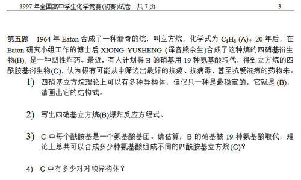
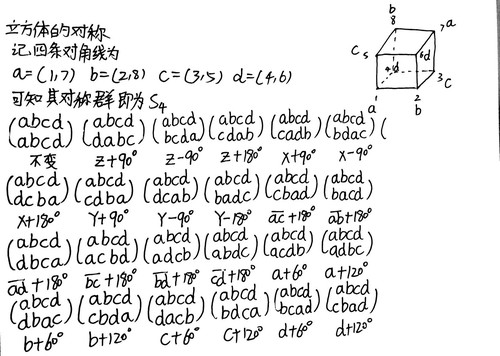
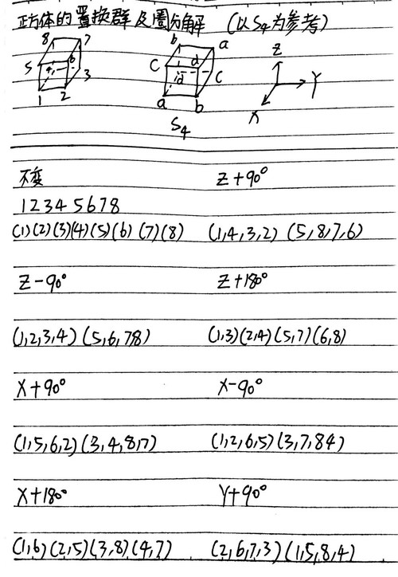
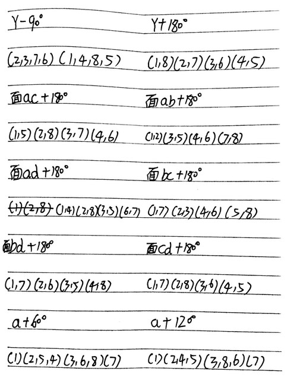
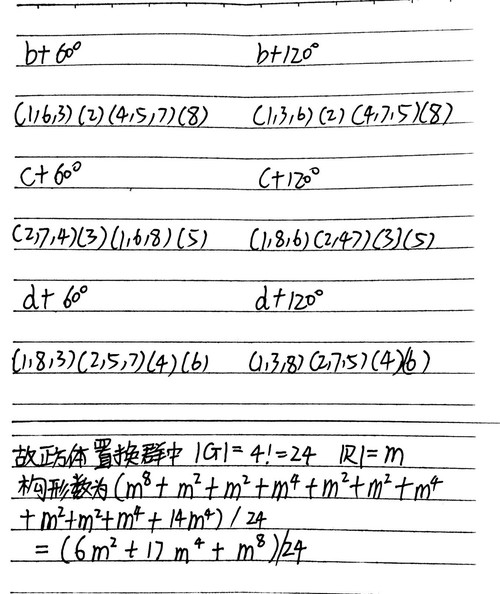
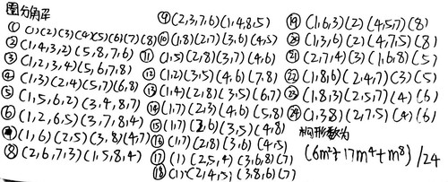
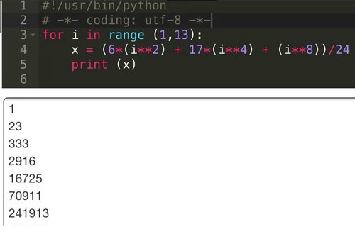
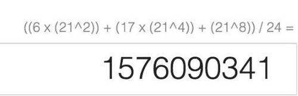

## 问题的提出

原题目：用二十种氨基酸取代立方烷，产物有多少种（不考虑手性异构）？

【注】：原题目改编自
[1997年国初题](http://wenku.baidu.com/view/1db8792c6bd97f192279e9ec.html)。

<!-- truncate -->

## 思路及文献

经大神指点应用[波利亚计数定理](http://baike.baidu.com/item/%E6%B3%A2%E5%88%A9%E4%BA%9A%E5%AE%9A%E7%90%86)解题。

找到文献：[走向数学丛书01-波利亚计数定理-萧文强.pdf](https://pan.baidu.com/s/1i4w2qlZ)

## 步骤及过程

按书中步骤写出了S4的[置换群](http://baike.baidu.com/view/1879054.htm)

图3-1

 以此作参照算出出立方体的圈分解

【注】：下图中的a,b,c,d为线段，定义见图3-1。
        面ab,ac,ad....为两条线段所在的平面。
        XYZ直角坐标系原点在立方体中心，即a,b,c,d的交点。

图3-2

图3-3

图3-4

### 圈分解小结

图3-5

-----

验证，验证公式中的式子能否被24整除来验证计算是否有误。

根据同余定理可知只需将1~12带入计算，若都为整数则原式可被24整除。

计算结果

## 结论

将21（20种氨基酸+氢元素）带入公式计算可得

结果中含立方烷本身，故最终结果为15,7609,0340种。