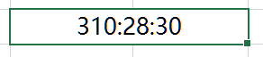
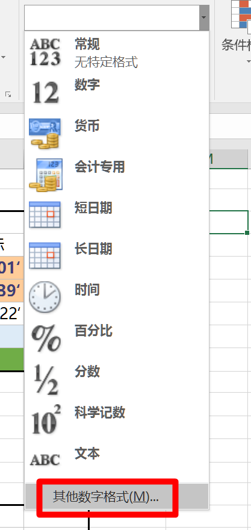
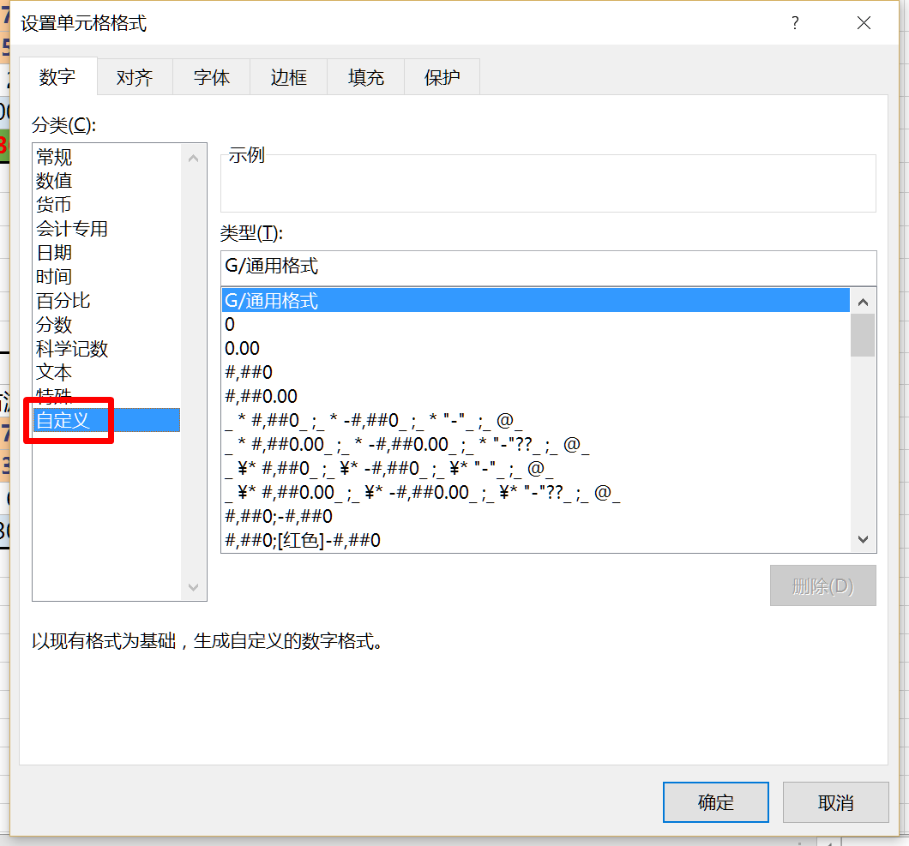
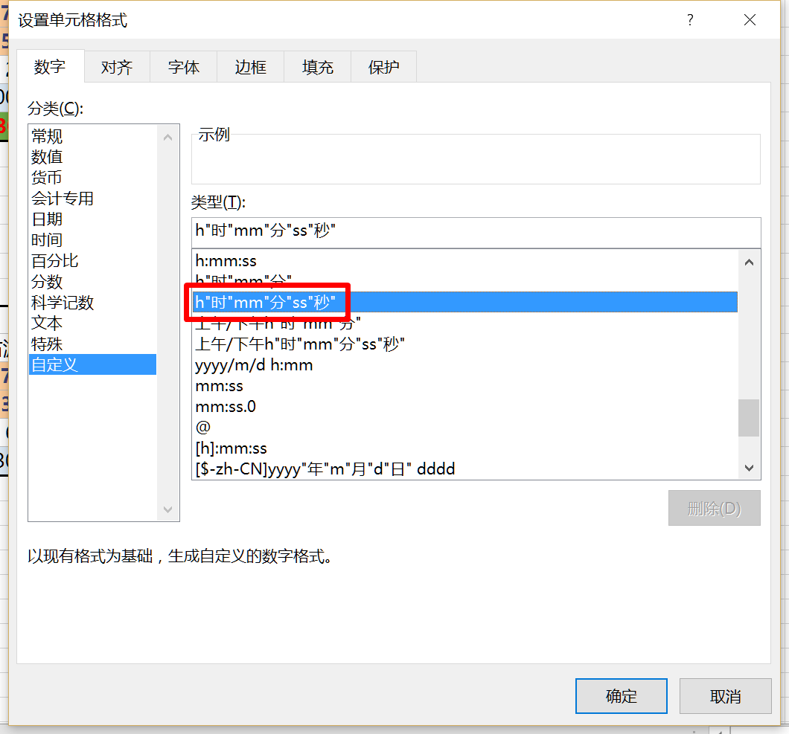
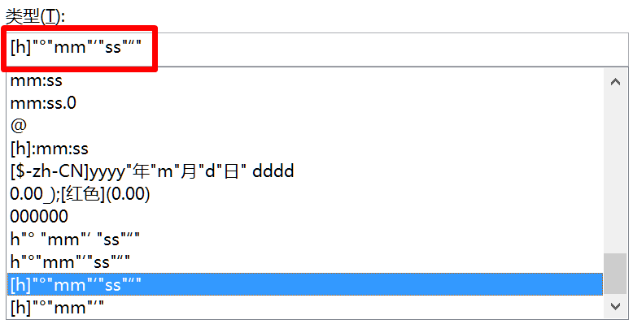
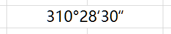
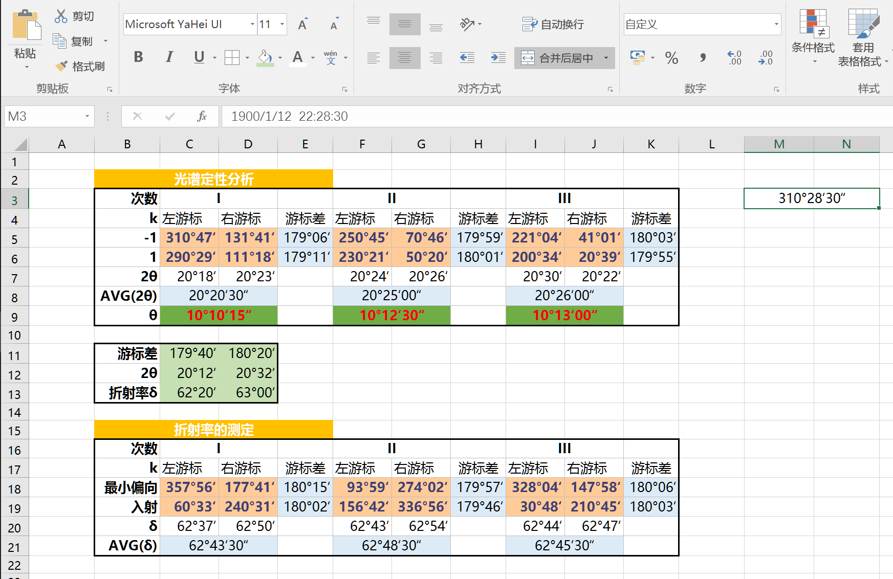
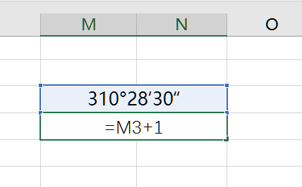
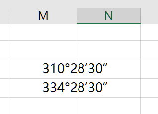

做光学实验需要处理数据，原始数据是以度分秒为单位的。
但excel并不支持这种格式。需要改进表示和计算方法。

<!-- truncate -->

## 度分秒的表示

以时间形式式输入角度      
即 `310°28'30" -> 310:28:30`

选中单元格
改单元格为 其他数字格式    

选数字->自定义    

找到时分秒   

改为 `[h]"°"mm"‘"ss"“"`

点确定
即可正常显示  

这样单元格的格式就设定好了   

## 探究

从公式栏可以看出，数据其实是以日期的形式表示的。    
当我们在做运算时要注意: `单元格+1 = 原始数据+24°`

eg: `310°28'30" + 1 = 334°28'30"`

即 把日期增加了一天

故要加上360° 应加上15

角度相加时可以对 15 取模，让结果在 `[0°,360°)` 之内
