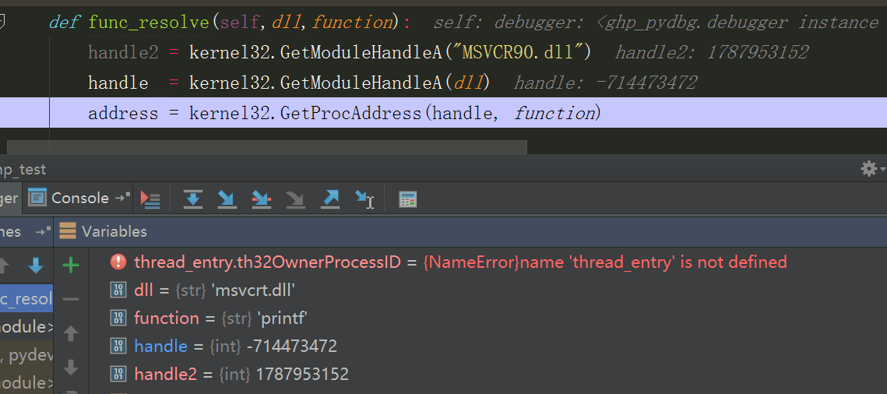
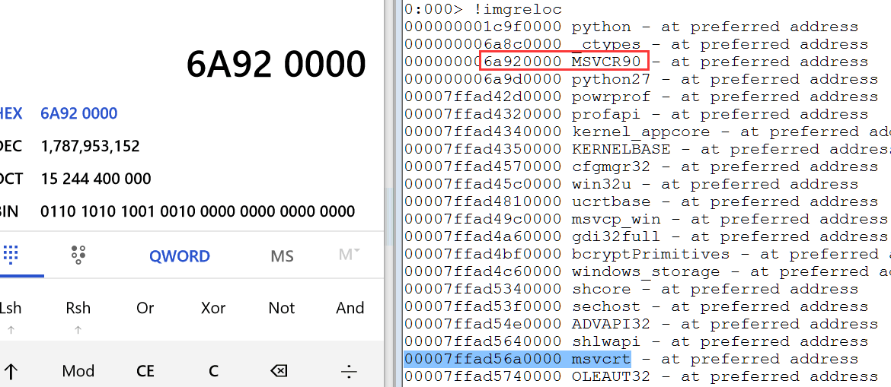
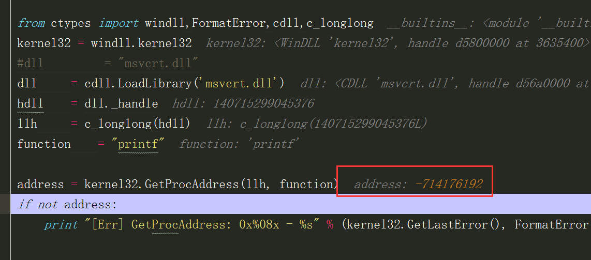
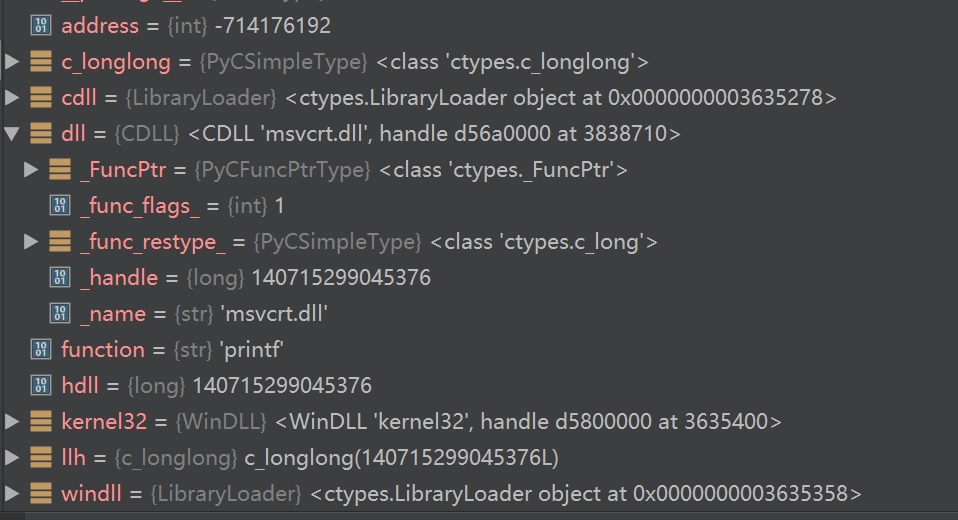

我又默默地开了[新坑 GHP-PyDbg](https://github.com/inkydragon/GHP-PyDbg).

这篇文章是填坑中坑有感

## 坑的起源及发展

我尝试在x64下跑GHP-PyDbg(实际上和PyDbg是一个东西)

然后遇到获取DLL中函数句柄的问题。本来很简单，Python有ctype写起来也很好。

```python showLineNumbers
# https://github.com/OpenRCE/pydbg/blob/master/pydbg.py#L1735
def func_resolve (self, dll, function):
    handle  = kernel32.LoadLibraryA(dll)
    address = kernel32.GetProcAddress(handle, function)

    kernel32.FreeLibrary(handle)

    return address
```

然后就报错，调试一下，发现是`handle`溢出了。

坑中坑就开始了。

<!-- truncate -->

## 坑中坑

讲道理：    
python是超出int自动转换为long   
GetModuleHandleA返回值是HMODULE跟系统有关，x64就是long

都不应该有问题，但是就是溢出了。





## 解决

在折腾了一天后.....

我绕了一圈，又绕回到原来的问题上了，不过有少许进步

我让GetProcAddress已经成功的取到printf的地址，之后就溢出了，还是不知道锅是谁的




然后我感觉Microsoft什么溢出没见过，在Windows上WINAPI那是最吼地.这个锅一定是Python的。

本着"我遇到的问题，别人一定遇到并解决过了"的信念。  
又经过一番查找，终于发现函数如果不指定返回的类型，Python默认用int去接收。

> 四、c 类型与 Python 类型， 参数类型、返回类型
> 
> 之所以会调用 addf 函数“失败”倒不是 Python 出了问题。原因是你没有“告诉” Python 这个函数的“容貌”（更正式的说法是“描述”）——函数的形参类型和返回类型。那么为什么我们调用 add 成功了呢？因为 Python 默认函数的参数类型和返回类型为 int 型。理所当然地 Python 以为 addf 返回了一个 int 类型的值。
>
> **无尽的数字眩晕症** [python 与 c 的交互](https://www.cnblogs.com/night-ride-depart/p/4907613.html)

然后我就改代码了,然后就好使了。

```python showLineNumbers
# https://github.com/inkydragon/GHP-PyDbg/commit/015b1eacd0d02db1e71cd20d5be88a76dee1af05#diff-32ef09858fe30f6d1098ead3ffdbb7b2R238
def func_resolve(self,dll,function):
    # 不指定返回值，python会将返回值默认当做int处理，导致溢出
    kernel32.GetModuleHandleA.restype = c_ulonglong
    kernel32.GetProcAddress.restype = c_longlong

    handle  = c_longlong(kernel32.GetModuleHandleA(dll))
    # 此时handle的实际类型为long，需要再次转换成 longlong，否则会报错 long int too long to convert
    address = kernel32.GetProcAddress(handle, function)

    kernel32.CloseHandle(handle)
    return address
```
