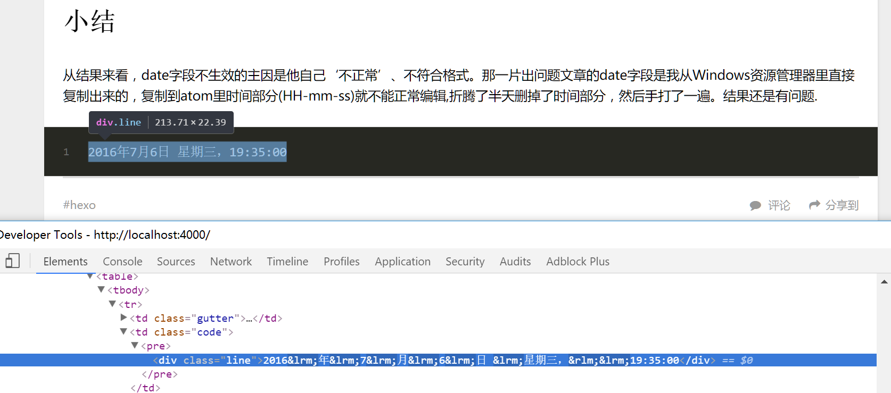

## 问题概述

`hexo new post`后在`Front-matter`里用`date:`指定时间，但`generate`后，页面显示的的时间为当天时间。

`_config.yml`日期格式是正确的，`post`里`date`的格式也是正确的。`hexo clean`后重新生成文章仍然出现此问题。
以前写文章都是直接`post`很少用`draft`，所以未遇到过同样的问题。

<!-- truncate -->

### 系统环境

```yml
hexo: 3.2.2
hexo-cli: 1.0.2
os: Windows_NT 10.0.14393 win32 x64
http_parser: 2.7.0
node: 4.5.0
v8: 4.5.103.37
uv: 1.9.1
zlib: 1.2.8
ares: 1.10.1-DEV
icu: 56.1
modules: 46
openssl: 1.0.2h
```

这个是所用的`_config.yml`配置

https://gist.github.com/inkydragon/1b1015ab4c642ca1d225a6e3d7703de8


## 初步尝试

### 搜索同类问题

> [@曹楠](https://www.zhihu.com/question/24166345/answer/26906184)
> 请先尝试将日期格式设为初始值，如果显示无误，再行尝试。
> 
> ```
> # Date / Time format
> ## Hexo uses Moment.js to parse and display date
> ## You can customize the date format as defined in
> ## http://momentjs.com/docs/#/displaying/format/
> date_format: MMM D YYYY
> time_format: H:mm:ss
> ```
> 
> **zhihu** [hexo文章发表日期怎么设置?](https://www.zhihu.com/question/24166345)


> @i36lib     
> @guoer 说的对，就是在文章的 md 文档前面加 date: ，这个时间的格式可以在你 blog 目录下的_config.yml 中通过 date_format: YYYY-MM-DD HH:mm:ss 来指定。
>
> **V2EX › 程序员** [hexo 文章生成时间问题](https://www.v2ex.com/t/231549)


> [@blueberryfields](http://stackoverflow.com/a/32975241)
> hexo controls the publish date (and other config options) in the source .md files. just add a date tag to the top of the file, for example:
>
> ```
> title: page title
> tags:
>   - aTag
>   - anotherTag
> id: 418
> categories:
>   - aCategory
>   - anotherCategory
> date: 2013-11-06 06:40:12
> ---
> ```
>
> Some text i'd like to have in the body of this post
>
> **stackoverflow** [How do i control post publish dates with hexo?](http://stackoverflow.com/questions/32974409/how-do-i-control-post-publish-dates-with-hexo)


### 尝试
检查过`_config.yml`以及`post`里的`date`

1. 【无效】`hexo clean` +　`hexo g`
2. 【无效】`hexo clean` +　`hexo g --safe`
3. 【无效】换为原版皮肤 `hexo clean` +　`hexo g`
4. 【无效】把`date_format`的值从`null`改为`'YYYY-MM-DD HH:mm:ss'` + `#1`
    ```html
    <!-- https://github.com/xiangming/landscape-plus/blob/master/layout/_partial/article.ejs -->
    <article id="<%= post.layout %>-<%= post.slug %>" class="article article-type-<%= post.layout %>" itemscope itemprop="blogPost">
      <div class="article-meta">
        <%- partial('post/date', {class_name: 'article-date', date_format: 'YYYY-MM-DD HH:mm:ss'}) %>
        <%- partial('post/category') %>
        .....
    ```
5. `#4` + 重新手打一遍 `date` 的值

用新的post测试`#4`时有效，但出问题的那篇文章发布后的日期与.md里的日期不一致，`#5`手工重新输入日期后问题发布日期显示正确。

6. 尝试将`article.ejs`还原，并用新的post测试

事实证明date字段可以正常工作。

## 小结
从结果来看，date字段不生效的主因是他自己‘不正常’、不符合格式。那一片出问题文章的date字段是我从Windows资源管理器里直接复制出来的，复制到atom里时间部分(HH-mm-ss)就不能正常编辑,折腾了半天删掉了时间部分，然后手打了一遍。结果还是有问题.

### 问题溯源
直接从Windows资源管理器里直接复制到Atom里的时间如下

```
2016‎年‎7‎月‎6‎日 ‎星期三，‏‎19:35:00
```

在浏览器中产看源代码


可以看见有坑爹的`&rlm;`，维基称之为 Right-to-left mark，说明锅是微软的。

~~以上~~
