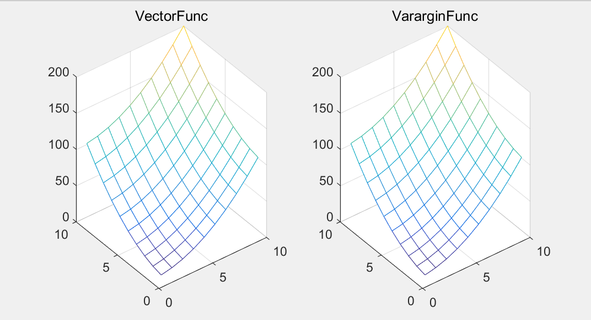
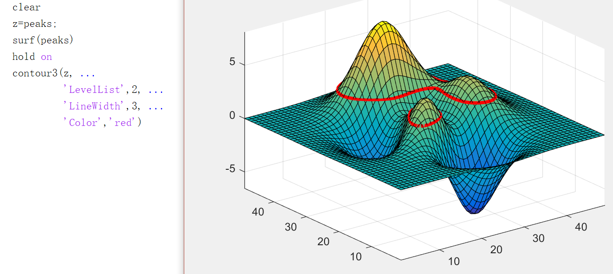
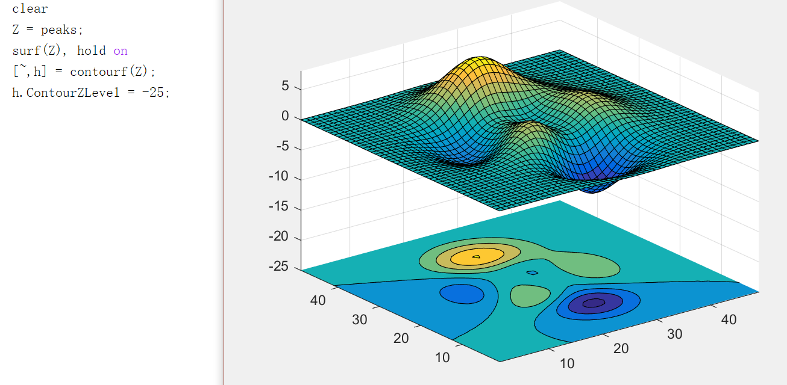

Some Matlab note

<!-- truncate -->

**向量值函数~多元函数转换**

2元函数画图要用meshgrid打网格，得到两个矩阵X，Y，然后mesh画图。

是直接的2元函数就很好办，但是有时候会碰到多元向量值函数，一般只有1个参数,是向量，每一列是一个参数。像这种函数就不能打网格画图。

Ex：
```
VectorFunc   = @(x, ~) x(:,1).^2 + x(:,2).^2 ;      %向量输入，D=2
VararginFunc = @(x, y) x.^2 + y.^2;                 %矩阵输入
```
**keyword**: 向量值函数 多元函数 reshape

Ans：


解决方案用reshape
``` matlab
clear
VectorFunc   = @(x, ~) x(:,1).^2 + x(:,2).^2 ;      %向量输入，D=2
VararginFunc = @(x, y) x.^2 + y.^2;                 %矩阵输入
Fitness = VectorFunc;

% 向量函数画图
[mesh_Plot_X, mesh_Plot_Y] = meshgrid(1:10, 1:10); % 打网格
[tmp_len_y, tmp_len_x] = size(mesh_Plot_X);        % 获取矩阵维度         
tmp_XX = [reshape(mesh_Plot_X, [], 1), ...         % 矩阵转向量
          reshape(mesh_Plot_Y, [], 1)];
fit=Fitness(tmp_XX);        % 计算
Vector_Z = reshape(Fitness(tmp_XX),tmp_len_y,tmp_len_x); % 结果转为矩阵

subplot(1,2,1),mesh(mesh_Plot_X, mesh_Plot_Y, Vector_Z);title('VectorFunc');

Varargin_Z = VararginFunc(mesh_Plot_X, mesh_Plot_Y);
subplot(1,2,2),mesh(mesh_Plot_X, mesh_Plot_Y, Varargin_Z);title('VararginFunc');
```



---

- [How do I plot the contour of a surface at a specific height?](https://cn.mathworks.com/matlabcentral/answers/165821-how-do-i-plot-the-contour-of-a-surface-at-a-specific-height)

**keyword**: contour3/等高线

``` matlab
clear
z=peaks;
surf(peaks)
hold on
contour3(z, ...
         'LevelList',2, ...
         'LineWidth',3, ...
         'Color','red')
```


---

- [Matlab how to change contourf plot's location on z axis](http://stackoverflow.com/questions/8054966/matlab-how-to-change-contourf-plots-location-on-z-axis)
- [plot multiple 2d contour plots in one 3d figure [Matlab]](http://stackoverflow.com/questions/24621439/plot-multiple-2d-contour-plots-in-one-3d-figure-matlab/24624311#24624311)
- [matlab contourf函数 怎么加一维高度数据？](https://www.zhihu.com/question/41687148)

ASK: 怎样移动等高线的位置？

**keyword**: surfc  contour/等高线

``` matlab
Z = peaks;
surf(Z), hold on
[~,h] = contourf(Z);
h.ContourZLevel = -10;
```

[2017-05-07]

---

- [Matlab: how to save animated plot to a gif](http://stackoverflow.com/questions/42132955/matlab-how-to-save-animated-plot-to-a-gif)
- [How can I create animated GIF images in MATLAB ?](https://cn.mathworks.com/matlabcentral/answers/94495-how-can-i-create-animated-gif-images-in-matlab)

**keyword**: Matlab GIF 动态图

Ans：
``` matlab GIF_example.m
clear;
x = 0:0.01:1;
n = 1:0.1:5;

nImages = length(n);
filename = 'GIF_testAnimated.gif'; % 指定GIf文件名

figure(1);
for idx = 1:nImages
    y = x.^n(idx);
    plot(x,y,'LineWidth',3);
    Formated_title = sprintf('y = x^n,  n = %-2.1f', n(idx) ); % 标题格式化
    title(Formated_title);
    drawnow;
    
    frame = getframe(1);
    img = frame2im(frame);
    
    [A,map] = rgb2ind(img,256);
    if idx == 1
        imwrite(A,map,filename,'gif','LoopCount',Inf,'DelayTime',0.1); % GIF 时间间隔可调
    else
        imwrite(A,map,filename,'gif','WriteMode','append','DelayTime',0.1);
    end
end

imwrite(A,map,filename,'gif','WriteMode','append','DelayTime',2); % 最后一帧 延时
```


---

- [Matlab中怎样快速将 行向量 复制m次 成为一个矩阵](http://www.ilovematlab.cn/thread-29957-1-1.html)

**keyword**: matlab 向量 变 矩阵

Eg:
``` matlab
A=[ 1 2 3 ];

B=[
  1 2 3 ;
  1 2 3 ;
  1 2 3 ;
  1 2 3 ];
```

Ans:

1. `repmat(A, TIMES, 1)`
2. `B=A(ones(TIMES, 1), :)`

``` matlab
>> B = repmat(A, 4, 1)
B =
     1     2     3
     1     2     3
     1     2     3
     1     2     3

>> B=A(ones(4,1),:)
B =
     1     2     3
     1     2     3
     1     2     3
     1     2     3
```
[2017-05-06]
