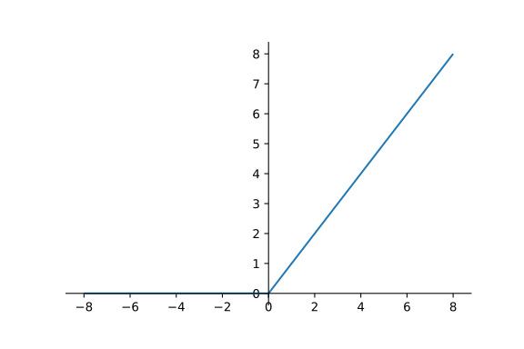
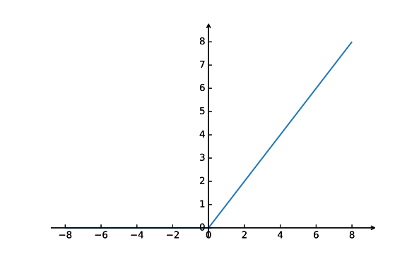
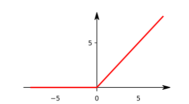
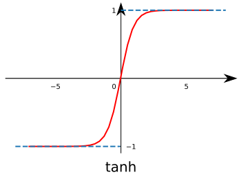

如何在 pyplot 中画出原点相交的&带箭头的坐标轴


我就想画个简单的 SVG 图，懒得开 Ai 了(~~虽然下面这个图还是用 Ai 画的~~)，希望用 pyplot 直接画。


`pyplot` 自带的坐标轴在左下角相交，并且没有箭头。

用自带的 `ax.spines['bottom'].set_position(('data',0))` 可以做到原点相交，但貌似加不了箭头。
ref: [Moving spines - Matplotlib tutorial](https://www.labri.fr/perso/nrougier/teaching/matplotlib/#moving-spines)

用 `mpl_toolkits.axisartist.axislines` 包里的 `SubplotZero` 可以画出原点相交的坐标轴，
可以加箭头。但没办法加上大箭头(默认的 `size=1` 太小，更大的画/显示不出来)。
ref: [Axis line styles](https://matplotlib.org/gallery/axisartist/demo_axisline_style.html)

最后看到 sf 上强行直接画箭头的就简单粗暴很符合要求。
ref: [python - How to make 'fuller' axis arrows with matplotlib - Stack Overflow](https://stackoverflow.com/a/23855021/10250520)

<!-- truncate -->

以下为各种尝试，按尝试的时间为序：

## 改现有轴的位置

ref: [Matplotlib tutorial](https://www.labri.fr/perso/nrougier/teaching/matplotlib/#moving-spines)

稍微改了下，去除了冗余的语句。

```python move axis to base point
# -*- coding: utf-8 -*-
import matplotlib.pyplot as plt
import numpy as np

x = np.linspace(-8, 8, 17)
f1 = lambda x: max(0,x) # ReLU
y1 = list(map(f1, x))

# 原点正交的坐标系
plt.figure()
plt.plot(x, y1)

ax = plt.gca()
ax.spines['right'].set_visible(False)
ax.spines['top'].set_visible(False)

#ax.xaxis.set_ticks_position('bottom')
#ax.yaxis.set_ticks_position('left')
ax.spines['bottom'].set_position(('data',0))
ax.spines['left'].set_position(('data',0))

plt.savefig('base_point-1.svg', dpi = 300)
plt.show()
```

**【效果】**


试完这个没有找到怎么给它加箭头，所以又换了一种方法。


## 原点新加轴且加箭头

ref: [Axis line styles — Matplotlib 3.0.2 documentation](https://matplotlib.org/gallery/axisartist/demo_axisline_style.html)

```python Add new ZeroAxis with arrows
# -*- coding: utf-8 -*-
import mpl_toolkits.axisartist as axisartist
import matplotlib.pyplot as plt
import numpy as np

x = np.linspace(-8, 8, 17)
f1 = lambda x: max(0,x) # ReLU
y1 = list(map(f1, x))

# 原点正交 + 带箭头
fig = plt.figure(1)
ax = axisartist.SubplotZero(fig, 111)
fig.add_subplot(ax)

ax.axis[:].set_visible(False)

for direction in ["xzero", "yzero"]:
    ax.axis[direction].set_axisline_style("->")
    ax.axis[direction].set_visible(True)

ax.axis["yzero"].set_axis_direction("left")

plt.plot(x, y1)
plt.savefig('base_point_arrow.svg', dpi = 300)
plt.show()
```

**【效果】**


这种箭头是加上了，但大小调不了，`size`调得过大就显示不出来，跑到图外面去了。


## 直接画箭头

ref:
- [python - How to make 'fuller' axis arrows with matplotlib - Stack Overflow]( https://stackoverflow.com/questions/17646247/how-to-make-fuller-axis-arrows-with-matplotlib/23855021#23855021 )

原答案是直接画的箭头，你要是给 y 轴加上数字刻度就会出现在左侧：


用前面学到的一句，调整一下 y 轴的位置：
`ax.spines['left'].set_position(('data',0))`

完整的绘图代码：

```python
# -*- coding: utf-8 -*-
import pylab as pl
import numpy as np
from numpy import exp

x = np.linspace(-8, 8, 17)

f1 = lambda x: max(0,x) # ReLU
y1 = list(map(f1, x))    
y2 = 1/(1+exp(-x))      # Sigmod
y3 = (1-exp(-2*x))/(1+exp(-2*x))    # tanh

fig = pl.figure()
ax = fig.add_subplot(111)
ax.plot(
        x, y1,
        color="red", 
        linewidth=2.0, 
        linestyle="-"
)

xmin, xmax = ax.get_xlim()
ymin, ymax = ax.get_ylim()

# 移除四周原有的边框
for side in ['bottom','right','top','left']:
    ax.spines[side].set_visible(False)

# 调整现有 y 轴位置
ax.spines['left'].set_position(('data',0))

# removing the axis ticks
pl.xticks([-5,0,5]) # labels
pl.yticks([5])
ax.xaxis.set_ticks_position('none')
#ax.yaxis.set_ticks_position('left')

# wider figure for demonstration
fig.set_size_inches(4,2.2)

# get width and height of axes object to compute
# matching arrowhead length and width
dps = fig.dpi_scale_trans.inverted()
bbox = ax.get_window_extent().transformed(dps)
width, height = bbox.width, bbox.height

# manual arrowhead width and length
hw = 1./20.*(ymax-ymin)
hl = 1./20.*(xmax-xmin)
lw = 1. # axis line width
ohg = 0.3 # arrow overhang

# compute matching arrowhead length and width
yhw = hw/(ymax-ymin)*(xmax-xmin)* height/width
yhl = hl/(xmax-xmin)*(ymax-ymin)* width/height

# draw x and y axis
ax.arrow(xmin, 0, xmax-xmin, 0., fc='k', ec='k', lw = lw,
         head_width=hw, head_length=hl, overhang = ohg,
         length_includes_head= True, clip_on = False)

ax.arrow(0, ymin, 0., ymax-ymin, fc='k', ec='k', lw = lw,
         head_width=yhw, head_length=yhl, overhang = ohg,
         length_includes_head= True, clip_on = False)

# clip_on = False if only positive x or y values.

pl.savefig('arrow_axis-2.svg', dpi = 300)
pl.show()
```

**【最终效果】**



## 三种激活函数的图像

### ReLU
```tex
$$
\begin{aligned}
f\left( x \right) 
&=\max \left( x,0 \right) \\
&=
\begin{cases}
\text{0,}&  x\le 0 \\
x,&         x\ge 0 \\
\end{cases}
\end{aligned}
$$
```


### Sigmod
```tex
$$
f\left( x \right) =\frac{1}{1+e^x}
$$
```


### tanh
```tex
$$
f\left( x \right) =\frac{1-e^{-2x}}{1+e^{-2x}}
$$
```



