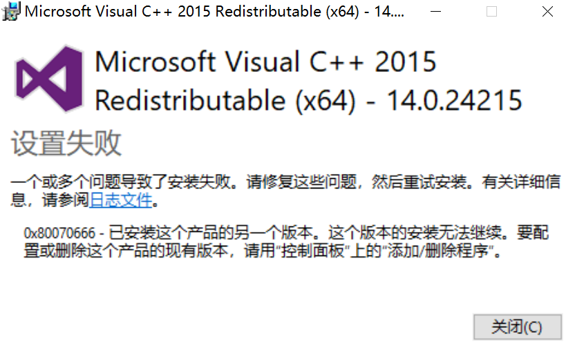

尝试在 Win 10 上编译安装带 GPU 支持的 TensorFlow

<!-- truncate -->

Note: 
搞了两天没什么进展，不过把所有的外部依赖全部下载下来了。
待续

ref：
- [在Windows 10 下用源码编译基于GPU的tensorflow.dll - 知乎](https://zhuanlan.zhihu.com/p/29029860)
- [我的AI之路(23)--在Windows下编译Bazel和使用Bazel编译tensorflow - XCCCCZ的博客 - CSDN博客](https://blog.csdn.net/XCCCCZ/article/details/82952927)
- [Tensorflow[源码安装时bazel行为解析] - 仙守 - 博客园](https://www.cnblogs.com/shouhuxianjian/p/9416934.html)
- [[Installing TensorFlow offline] $ ./configure fails because no Internet connection is available for my server. · Issue #6210 · tensorflow/tensorflow](https://github.com/tensorflow/tensorflow/issues/6210#issuecomment-288155573)
- [tensorflow离线源码安装 - huang_yx005的博客 - CSDN博客](https://blog.csdn.net/huang_yx005/article/details/78873134)
- [Tensorflow 离线安装跳坑总结 - may0324的博客 - CSDN博客](https://blog.csdn.net/may0324/article/details/53413024)


-----

**【官方文档-begin】**

- [Build from source on Windows  |  TensorFlow@tensorflow.org](https://www.tensorflow.org/install/source_windows)
- [Build from source on Windows  |  TensorFlow#tensorflow.google.cn](https://tensorflow.google.cn/install/source_windows)

以下为官方文档的部分翻译（用引用标出）
以及一些问题的记录。

-----

<!-- # Build from source on Windows -->
## 在 Windows 上从源码编译安装

<!-- 
Build a TensorFlow *pip* package from source and install it on Windows.

Note: We already provide well-tested, pre-built [TensorFlow packages](./pip.md)
for Windows systems. 
-->
> 在 windows 上，从源码构建出一个 TensorFlow 的 *pip* 包，并安装。
> 
> 注意！我们已经为 windows 系统提供了经过良好测试的、预构建的 [TensorFlow 包](./pip.md)


<!-- ## Setup for Windows -->
### Windows 上的准备工作

<!-- Install the following build tools to configure your Windows development
environment. -->
> 安装以下构建工具，配置好你的 Windows 开发环境。

<!-- ### Install Python and the TensorFlow package dependencies -->
#### 安装 Python 和 TensorFlow 的相关依赖

Python **安装包**国内镜像：
- [3.6.8 - taobao Python Mirror](https://npm.taobao.org/mirrors/python/3.6.8/)
- [3.5.4 - taobao Python Mirror](https://npm.taobao.org/mirrors/python/3.5.4/)
- [所有版本 - taobao Python Mirror](https://npm.taobao.org/mirrors/python)

注意！Python 的**镜像源**建议用 tuna [Pypi | 镜像站使用帮助 | 清华大学开源软件镜像站 | Tsinghua Open Source Mirror](https://mirrors.tuna.tsinghua.edu.cn/help/pypi/)

<!-- 
Install a
[Python 3.5.x or Python 3.6.x 64-bit release for Windows](https://www.python.org/downloads/windows/).
Select *pip* as an optional feature and add it to your `%PATH%` environmental variable.

Install the TensorFlow *pip* package dependencies: 
-->
> 安装为 windows 准备的 64 位的 [Python 3.5.x 或 Python 3.6.x 64-bit 发行版](https://www.python.org/downloads/windows/) 
> 安装的时候同时选上 安装 *pip*，并把它添加到你的环境变量里。
> 
> 用 *pip* 安装 TensorFlow 的 python 依赖：

<!-- 
<pre class="devsite-click-to-copy">
<code class="devsite-terminal tfo-terminal-windows">pip3 install six numpy wheel</code>
<code class="devsite-terminal tfo-terminal-windows">pip3 install keras_applications==1.0.5 --no-deps</code>
<code class="devsite-terminal tfo-terminal-windows">pip3 install keras_preprocessing==1.0.3 --no-deps</code>
</pre> 
-->
```python
pip3 install six numpy wheel
pip3 install keras_applications==1.0.6 --no-deps
pip3 install keras_preprocessing==1.0.5 --no-deps
```

<!-- The dependencies are listed in the
[`setup.py`](https://github.com/tensorflow/tensorflow/blob/master/tensorflow/tools/pip_package/setup.py)
file under `REQUIRED_PACKAGES`. -->
> 更详细的依赖列出于 [`setup.py`](https://github.com/tensorflow/tensorflow/blob/master/tensorflow/tools/pip_package/setup.py) 文件的 `REQUIRED_PACKAGES` 数组及其下方。

截取的完整依赖：
用不上的依赖已被注释掉，无关的语句已省略。

```python dependencies
_VERSION = '1.12.0'

REQUIRED_PACKAGES = [
    'absl-py >= 0.1.6',
    'astor >= 0.6.0',
    'gast >= 0.2.0',
    'keras_applications >= 1.0.6',
    'keras_preprocessing >= 1.0.5',
    'numpy >= 1.13.3',
    'six >= 1.10.0',
    'protobuf >= 3.6.1',
    'tensorboard >= 1.12.0, < 1.13.0',
    'tensorflow_estimator >= 1.10.0',
    'termcolor >= 1.1.0',
]

## windows 需要装这个
if sys.byteorder == 'little':
  # grpcio does not build correctly on big-endian machines due to lack of
  # BoringSSL support.
  # See https://github.com/tensorflow/tensorflow/issues/17882.
  REQUIRED_PACKAGES.append('grpcio >= 1.8.6')

....

## python3 requires wheel 0.26
if sys.version_info.major == 3:
  REQUIRED_PACKAGES.append('wheel >= 0.26')
else:
  REQUIRED_PACKAGES.append('wheel')
  # mock comes with unittest.mock for python3, need to install for python2
  REQUIRED_PACKAGES.append('mock >= 2.0.0')

## tf-nightly should depend on tb-nightly
if 'tf_nightly' in project_name:
  for i, pkg in enumerate(REQUIRED_PACKAGES):
    if 'tensorboard' in pkg:
      REQUIRED_PACKAGES[i] = 'tb-nightly >= 1.13.0a0, < 1.14.0a0'
    elif 'tensorflow_estimator' in pkg and '2.0' in project_name:
      REQUIRED_PACKAGES[i] = 'tensorflow-estimator-2.0-preview'
    elif 'tensorflow_estimator' in pkg:
      REQUIRED_PACKAGES[i] = 'tf-estimator-nightly'

## 新一点的 tf 都是 py 3.5 以上的啦
'''
## weakref.finalize and enum were introduced in Python 3.4
if sys.version_info < (3, 4):
  REQUIRED_PACKAGES.append('backports.weakref >= 1.0rc1')
  REQUIRED_PACKAGES.append('enum34 >= 1.1.6')
'''
```

一般来说配置好 python 的镜像源之后装这些东西都没有问题。
所以我只执行了上面提到的三条语句。
不过为了以防万一，网不好什么的，我还是尽可能地下载了 python3.6 版的 `.whl` 包，以备急用。

完整 python3.6 依赖列表
absl-py
astor
gast
keras_applications
keras_preprocessing
numpy
six
protobuf
tensorboard
tensorflow_estimator
termcolor
grpcio
wheel
mock

一句话 pip 安装：
```python
pip3 install absl-py, astor, gast, keras_applications, keras_preprocessing, numpy, six, protobuf, tensorboard, tensorflow_estimator, termcolor, grpcio, wheel, mock
```


**附无 wheel 版的 python 依赖**
即需要通过 pip 安装
- `absl-py`
- `gast`
- `termcolor`

**需要注意 python 版本的包**
即 py3.5/3.6 安装的版本不同
- [`numpy` · PyPI](https://pypi.org/project/numpy/#files)
- [`protobuf` · PyPI](https://pypi.org/project/protobuf/#files)
- [`grpcio` · PyPI](https://pypi.org/project/grpcio/#files)

找 `.whl` 包的网站
- [Python Wheels](https://pythonwheels.com/)
  查看对 python 包对 wheel 的支持。（列表不全，需要到 PyPI 上进一步确认，也就是说，他这里没有不一定真没有。）
- [PyPI – the Python Package Index · PyPI](https://pypi.org/)
- [Python Extension Packages for Windows - Christoph Gohlke](https://www.lfd.uci.edu/~gohlke/pythonlibs/)
- [Pypi | 镜像站使用帮助 | 清华大学开源软件镜像站 | Tsinghua Open Source Mirror](https://mirrors.tuna.tsinghua.edu.cn/help/pypi/)


#### 安装 Bazel

<!-- 
[Install Bazel](https://docs.bazel.build/versions/master/install-windows.html),
the build tool used to compile TensorFlow.

Add the location of the Bazel executable to your `%PATH%` environment variable. 
-->
> 安装用于编译 Tensorflow 的工具：[Bazel](https://docs.bazel.build/versions/master/install-windows.html)。
> 
> 并把 Bazel 的可执行文件添加到你的 `%PATH%` 环境变量中去。

**Bazel on Windows 依赖**
- 64 bit Windows 7 or newer, or 64 bit Windows Server 2008 R2 or newer
- MSYS2 shell
  国内下载镜像，文件命名格式为 `msys2-<架构>-<日期>.exe` 选最新的。
  - [msys2@x86_64 | 清华大学开源软件镜像站 | Tsinghua Open Source Mirror](https://mirrors.tuna.tsinghua.edu.cn/msys2/distrib/x86_64/)
- [Download Visual C++ Redistributable for Visual Studio 2015 from Official Microsoft Download Center](https://www.microsoft.com/zh-CN/download/details.aspx?id=48145) 
  These are common DLLs that Bazel needs. You may already have them installed.

安装 `vc_redist.x64` 时可能报错


看日志
```
Error 0x80070666: Cannot install a product when a newer version is installed.
```
应该是已经安装了更新的版本，那就继续，不用管他。


#### 安装 MSYS2

**上面装 Bazel 的时候作为依赖之一，已经装过了**

这里可以设置国内的镜像源
- [Msys2 | 镜像站使用帮助 | 清华大学开源软件镜像站 | Tsinghua Open Source Mirror](https://mirrors.tuna.tsinghua.edu.cn/help/msys2/)

<!-- 
[Install MSYS2](https://www.msys2.org/) for the bin tools needed to
build TensorFlow. If MSYS2 is installed to `C:\msys64`, add
`C:\msys64\usr\bin` to your `%PATH%` environment variable. Then, using `cmd.exe`,
run: 
-->
> 安装 [MSYS2](https://www.msys2.org/)，准备好构建 Tensorflow 所需的各种工具。
> 如果你把 MSYS2 安装在 `C:\msys64` 下，请把 `C:\msys64\usr\bin` 添加到你的 `%PATH%` 环境变量中。
> 然后打开 `cmd.exe` 并执行：
> 
> ```sh
> pacman -S git patch unzip
> ```

上面这句大概要下载 30M 的东西，该不该镜像源都行，改了基本秒下完。


#### 安装 Visual C++ Build Tools 2015

<!-- 
Install the *Visual C++ build tools 2015*. This comes with *Visual Studio 2015*
but can be installed separately:

1. Go to the [Visual Studio downloads](https://visualstudio.microsoft.com/vs/older-downloads/){:.external},
2. Select *Redistributables and Build Tools*,
3. Download and install:
   - *Microsoft Visual C++ 2015 Redistributable Update 3*
   - *Microsoft Build Tools 2015 Update 3*

Note: TensorFlow is tested against the *Visual Studio 2015 Update 3*. 
-->
> 安装 *Visual C++ build tools 2015*，*Visual Studio 2015*自带这些构建工具，不过它们也可以单独安装。
>  
> 1. 打开 - [下载旧版 Visual Studio 软件 | Visual Studio - Visual Studio](https://visualstudio.microsoft.com/zh-hans/vs/older-downloads/#redistributables-and-build-tools-zh-hans) 
> 2. 选择 *可再发行组件和生成工具*；
> 3. 下载并安装：
>   - *Microsoft Visual C++ 2015 Redistributable 更新 3*
>   - *Microsoft 生成工具 2015 更新 3*
> 
> 注意！TensorFlow 在 *Visual Studio 2015 Update 3* 中进行了测试。


#### 安装 GPU 支持 (可选的)

<!-- See the Windows [GPU support](./gpu.md) guide to install the drivers and additional
software required to run TensorFlow on a GPU. -->
> 参见 Windows 上的 [GPU 支持](./gpu.md)说明，安装在 GPU 上运行 TensorFlow 所需的驱动及其他附加软件。

到这里下载老版的 CUDA Toolkit
- [CUDA Toolkit Archive | NVIDIA Developer](https://developer.nvidia.com/cuda-toolkit-archive)
  1.5 G 的样子

1. 别用 NVIDIA CUDA Profiling Tools Interface (**CUPTI**)  
    > CUPTI 1.0 should be used along with the** CUDA Toolkit 10.0** production release
    
    新版的 tf 1.12.0 才支持到 CUDA 9.0。

2. NCCL 2.2 需要多 GPU 支持才用去下。需要登陆UFF
3. TensorRT 4.0 不支持 win 上面的 Tensorflow，只支持 Caffe 和 UFF
    > The Windows zip package for TensorRT does not provide Python support. Also, **only the Caffe and UFF parsers are supported on Windows at this time**. Python and the ONNX parser may be supported in the future.
    
    另外通过 zip 安装它需要 CUDA Toolkit **10.0** 和 cuDNN 7.3.1。所以 Windows 上也别想了。

```
SET PATH=C:\tools\cuda\bin;%PATH%
```


<!-- ### Download the TensorFlow source code -->
#### 下载 TensorFlow 的源码

<!-- 
Use [Git](https://git-scm.com/){:.external} to clone the
[TensorFlow repository](https://github.com/tensorflow/tensorflow){:.external}
(`git` is installed with MSYS2): 
-->
> 使用 [`Git`](https://git-scm.com/) `clone` [TensorFlow 的源码](https://github.com/tensorflow/tensorflow)
> (`git` 已经由 MSYS2 安装了)

<!-- 
<pre class="devsite-click-to-copy">
<code class="devsite-terminal tfo-terminal-windows">git clone https://github.com/tensorflow/tensorflow.git</code>
<code class="devsite-terminal tfo-terminal-windows">cd tensorflow</code>
</pre> 
-->
```sh
git clone https://github.com/tensorflow/tensorflow.git
cd tensorflow
```

<!-- 
The repo defaults to the `master` development branch. You can also checkout a
[release branch](https://github.com/tensorflow/tensorflow/releases){:.external}
to build:

<pre class="devsite-terminal tfo-terminal-windows prettyprint lang-bsh">
git checkout <em>branch_name</em>  # r1.9, r1.10, etc.
</pre>

Key Point: If you're having build problems on the latest development branch, try
a release branch that is known to work. 
-->
> clone 下来的 repo 默认在 master 分支上。你可以选一个合适的 [release 分支](https://github.com/tensorflow/tensorflow/releases)用于构建：
> 
> <pre> git checkout <em>branch_name</em>  # r1.9, r1.10, etc. </pre>
> 
> 关键点！如果你在最新的主分支上构建出错了，你可以尝试一下通过测试的 release 分支。

<!-- ## Configure the build -->
### 构建配置

Configure your system build by running the following at the root of your
TensorFlow source tree:

<pre class="devsite-terminal tfo-terminal-windows devsite-click-to-copy">
python ./configure.py
</pre>
>

This script prompts you for the location of TensorFlow dependencies and asks for
additional build configuration options (compiler flags, for example). The
following shows a sample run of `python ./configure.py` (your session may differ):


```python sample configuration session
PS C:\tf-tools\tensorflow-1.12.0> python ./configure.py
WARNING: The following rc files are no longer being read, please transfer their contents or import their path into one of the standard rc files:
c:\tf-tools\tensorflow-1.12.0/tools/bazel.rc
nul
WARNING: --batch mode is deprecated. Please instead explicitly shut down your Bazel server using the command "bazel shutdown".
INFO: Invocation ID: 553ffb69-817b-4b6f-b0f9-b76a5937c4a3
You have bazel 0.21.0 installed.
Please specify the location of python. [Default is C:\Users\woclass\AppData\Local\Programs\Python\Python36\python.exe]:


Found possible Python library paths:
  C:\Users\woclass\AppData\Local\Programs\Python\Python36\lib\site-packages
Please input the desired Python library path to use.  Default is [C:\Users\woclass\AppData\Local\Programs\Python\Python36\lib\site-packages]

Do you wish to build TensorFlow with Apache Ignite support? [Y/n]: n
No Apache Ignite support will be enabled for TensorFlow.

Do you wish to build TensorFlow with XLA JIT support? [y/N]: y
XLA JIT support will be enabled for TensorFlow.

Do you wish to build TensorFlow with ROCm support? [y/N]: N
No ROCm support will be enabled for TensorFlow.

Do you wish to build TensorFlow with CUDA support? [y/N]: y
CUDA support will be enabled for TensorFlow.

Please specify the CUDA SDK version you want to use. [Leave empty to default to CUDA 9.0]: 9.2


Please specify the location where CUDA 9.2 toolkit is installed. Refer to README.md for more details. [Default is C:/Program Files/NVIDIA GPU Computing Toolkit/CUDA/v9.2]:


Please specify the cuDNN version you want to use. [Leave empty to default to cuDNN 7]: 7.4


Please specify the location where cuDNN 7 library is installed. Refer to README.md for more details. [Default is C:/Program Files/NVIDIA GPU Computing Toolkit/CUDA/v9.2]: C:/tf-tools/cuda/


Please specify a list of comma-separated Cuda compute capabilities you want to build with.
You can find the compute capability of your device at: https://developer.nvidia.com/cuda-gpus.
Please note that each additional compute capability significantly increases your build time and binary size. [Default is: 3.5,7.0]: 6.1


Please specify optimization flags to use during compilation when bazel option "--config=opt" is specified [Default is /arch:AVX]: -march=native


Would you like to override eigen strong inline for some C++ compilation to reduce the compilation time? [Y/n]: Y
Eigen strong inline overridden.

PS C:\tf-tools\tensorflow-1.12.0>
```

各个选项解释

1. 

关于 optimization flags 请参见：
tf 官网讲的不清楚。
- [x86 - How to compile Tensorflow with SSE4.2 and AVX instructions? - Stack Overflow](https://stackoverflow.com/questions/41293077/how-to-compile-tensorflow-with-sse4-2-and-avx-instructions)


#### Configuration options

<!-- 
For [GPU support](./gpu.md), specify the versions of CUDA and cuDNN. If your
system has multiple versions of CUDA or cuDNN installed, explicitly set the
version instead of relying on the default. `./configure.py` creates symbolic links
to your system's CUDA libraries—so if you update your CUDA library paths, this
configuration step must be run again before building.

Note: Starting with TensorFlow 1.6, binaries use AVX instructions which may not
run on older CPUs. 
-->
> 对于 [支持 GPU](./gpu.md)，请在配置时指明 CUDA 和 cuDNN 的版本。
> 如果你的系统中安装了多个版本的 CUDA 或 cuDNN，请显式的设置版本，而不是使用默认值。
> `./configure.py` 会创建一个到你系统中 CUDA 库的符号链接。——所以如果你更新了 CUDA 的路径，
> 在构建之前，这个配置步骤就必须重新来过。
> 
> 注意！从 TensorFlow 1.6 开始，编译出的二进制文件使用了一些老 CPU 不支持的 AVX 指令集。


<!-- ## Build the pip package -->
### 构建 pip 包

<!-- ### Bazel build -->
#### Bazel 构建

<!-- #### CPU-only -->
##### 仅支持 CPU

<!-- 
Use `bazel` to make the TensorFlow package builder with CPU-only support:

<pre class="devsite-terminal tfo-terminal-windows devsite-click-to-copy">
bazel build --config=opt //tensorflow/tools/pip_package:build_pip_package
</pre> 
-->
> 使用 `bazel` 构建 TensorFlow 包且只支持 CPU：
> 
> <pre> bazel build --config=opt //tensorflow/tools/pip_package:build_pip_package </pre>

<!-- #### GPU support -->
##### 带 GPU 支持

<!-- 
To make the TensorFlow package builder with GPU support:

<pre class="devsite-terminal tfo-terminal-windows devsite-click-to-copy">
bazel build --config=opt --config=cuda //tensorflow/tools/pip_package:build_pip_package
</pre> 
-->
> 构建 TensorFlow 包并支持 GPU：
> 
> <pre> bazel build --config=opt --config=cuda //tensorflow/tools/pip_package:build_pip_package </pre>

可能的报错：

1. `ERROR: Config value cuda is not defined in any .rc file`

```
PS C:\tf-tools\tensorflow-1.12.0> bazel build --config=opt --config=cuda --define=no_tensorflow_py_deps=true //tensorflow/tools/pip_package:build_pip_package
WARNING: The following rc files are no longer being read, please transfer their contents or import their path into one of the standard rc files:
c:\tf-tools\tensorflow-1.12.0/.bazelrc
c:\tf-tools\tensorflow-1.12.0/tools/bazel.rc
Starting local Bazel server and connecting to it...
INFO: Options provided by the client:
  Inherited 'common' options: --isatty=1 --terminal_columns=218
INFO: Options provided by the client:
  'build' options: --python_path=C:/Users/woclass/AppData/Local/Programs/Python/Python36/python.exe
INFO: Reading rc options for 'build' from c:\tf-tools\tensorflow-1.12.0\.tf_configure.bazelrc:
  'build' options: --action_env PYTHON_BIN_PATH=C:/Users/woclass/AppData/Local/Programs/Python/Python36/python.exe --action_env PYTHON_LIB_PATH=C:/Users/woclass/AppData/Local/Programs/Python/Python36/lib/site-packaData/Local/Programs/Python/Python36/lib/site-packages --python_path=C:/Users/woclass/AppData/Local/Programs/Python/Python36/python.exe --define with_xla_support=true acEED_ROCM=0 --action_env TF_NEED_CUDA=1 --action_--action_env TF_NEED_OPENCL_SYCL=0 --action_env TF_NEED_ROCM=0 --action_env TF_NEED_CUDA=1 --action_env CUDA_TOOLKIT_PATH=C:/Program Files/NVIDIA GPU Computing Toolkit//vnv TF_CUDNN_VERSION=7 --action_env TF_CUDA_COMPUCUDA/v9.2 --action_env TF_CUDA_VERSION=9.2 --action_env CUDNN_INSTALL_PATH=C:/tf-tools/cuda --action_env TF_CUDNN_VERSION=7 --action_env TF_CUDA_COMPUTE_CAPABILITIES=6.tiimental_shortened_obj_file_path=true --define=no1 --action_env TF_CUDA_CLANG=0 --config=cuda --config monolithic --copt=-w --host_copt=-w --verbose_failures --distinct_host_configuration=false --experimental_shorteneled_obj_file_path=true --define=no_tensorflow_py_deps=true --define=override_eigen_strong_inline=true
ERROR: Config value cuda is not defined in any .rc file
INFO: Invocation ID: cf33d918-f992-4fce-bc5b-1956426dbaa7
PS C:\tf-tools\tensorflow-1.12.0>
```

- [Build from source -> build the pip package -> GPU support -> bazel build -> ERROR: Config value cuda is not defined in any .rc file · Issue #23401 · tensorflow/tensorflow](https://github.com/tensorflow/tensorflow/issues/23401)
  按照说明复制 rc 文件就好

2. [deep learning - Geting ERROR: Config value cuda is not defined in any .rc file when trying to train mobilenet in tensorflow - Stack Overflow](https://stackoverflow.com/questions/52041661/geting-error-config-value-cuda-is-not-defined-in-any-rc-file-when-trying-to-tr)
  出这个错式用错 bazel 版本了，现在 tf 只支持 bazel 0.15


3. 又报错了，~~可能是依赖没装好~~ 装完全部的 python 依赖依旧同样报错
```
PS C:\tf-tools\tensorflow-1.12.0> bazel build --config=opt --config=cuda --define=no_tensorflow_py_deps=true //tensorflow/tools/pip_package:build_pip_package
WARNING: The following configs were expanded more than once: [cuda]. For repeatable flags, repeats are counted twice and may lead to unexpected behavior.
DEBUG: C:/users/woclass/_bazel_woclass/5rstnx6i/external/bazel_tools/tools/cpp/lib_cc_configure.bzl:115:5:
Auto-Configuration Warning: 'BAZEL_VC' is not set, start looking for the latest Visual C++ installed.
DEBUG: C:/users/woclass/_bazel_woclass/5rstnx6i/external/bazel_tools/tools/cpp/lib_cc_configure.bzl:115:5:
Auto-Configuration Warning: Looking for VS%VERSION%COMNTOOLS environment variables, eg. VS140COMNTOOLS
DEBUG: C:/users/woclass/_bazel_woclass/5rstnx6i/external/bazel_tools/tools/cpp/lib_cc_configure.bzl:115:5:
Auto-Configuration Warning: Visual C++ build tools found at C:\Program Files (x86)\Microsoft Visual Studio 14.0\VC\
DEBUG: C:/users/woclass/_bazel_woclass/5rstnx6i/external/bazel_tools/tools/cpp/lib_cc_configure.bzl:115:5:
Auto-Configuration Warning: 'BAZEL_VC' is not set, start looking for the latest Visual C++ installed.
DEBUG: C:/users/woclass/_bazel_woclass/5rstnx6i/external/bazel_tools/tools/cpp/lib_cc_configure.bzl:115:5:
Auto-Configuration Warning: Looking for VS%VERSION%COMNTOOLS environment variables, eg. VS140COMNTOOLS
DEBUG: C:/users/woclass/_bazel_woclass/5rstnx6i/external/bazel_tools/tools/cpp/lib_cc_configure.bzl:115:5:
Auto-Configuration Warning: Visual C++ build tools found at C:\Program Files (x86)\Microsoft Visual Studio 14.0\VC\
DEBUG: C:/users/woclass/_bazel_woclass/5rstnx6i/external/bazel_tools/tools/cpp/lib_cc_configure.bzl:115:5:
Auto-Configuration Warning: 'BAZEL_VC' is not set, start looking for the latest Visual C++ installed.
DEBUG: C:/users/woclass/_bazel_woclass/5rstnx6i/external/bazel_tools/tools/cpp/lib_cc_configure.bzl:115:5:
Auto-Configuration Warning: Looking for VS%VERSION%COMNTOOLS environment variables, eg. VS140COMNTOOLS
DEBUG: C:/users/woclass/_bazel_woclass/5rstnx6i/external/bazel_tools/tools/cpp/lib_cc_configure.bzl:115:5:
Auto-Configuration Warning: Visual C++ build tools found at C:\Program Files (x86)\Microsoft Visual Studio 14.0\VC\
ERROR: C:/tf-tools/tensorflow-1.12.0/tensorflow/core/BUILD:644:1: no such package '@com_google_absl//absl/types': java.io.IOException: thread interrupted and referenced
by '//tensorflow/core:lib'
ERROR: Analysis of target '//tensorflow/tools/pip_package:build_pip_package' failed; build aborted: no such package '@com_google_absl//absl/types': java.io.IOException:
thread interrupted
INFO: Elapsed time: 307.235s
INFO: 0 processes.
FAILED: Build did NOT complete successfully (164 packages loaded)
```

- [我的AI之路(23)--在Windows下编译Bazel和使用Bazel编译tensorflow - XCCCCZ的博客 - CSDN博客](https://blog.csdn.net/XCCCCZ/article/details/82952927)

~~参照其中的删掉缓存~~ 不存在的，没找到缓存，看上去式网络问题

4. 这次换了个包报错
```
PS C:\tf-tools\tensorflow-1.12.0> bazel build --config=opt --config=cuda --define=no_tensorflow_py_deps=true //tensorflow/tools/pip_package:build_pip_package
Starting local Bazel server and connecting to it...
...........
WARNING: The following configs were expanded more than once: [cuda]. For repeatable flags, repeats are counted twice and may lead to unexpected behavior.
ERROR: C:/tf-tools/tensorflow-1.12.0/tensorflow/BUILD:353:1: no such package '@grpc//': java.io.IOException: thread interrupted and referenced by '//tensorflow:grpc++'
ERROR: Analysis of target '//tensorflow/tools/pip_package:build_pip_package' failed; build aborted: Analysis failed
INFO: Elapsed time: 396.676s
INFO: 0 processes.
FAILED: Build did NOT complete successfully (175 packages loaded)
```

估计还是网不好，重试 x2

继续重试 x3

准备新套路，先 `fetch` 然后再 build

```
bazel --output_user_root=C:/tf-tools/bazel_cache fetch //tensorflow/tools/pip_package:build_pip_package
```

如果出现一下的报错，就把对应的包单独下载下来，然后改名放到对应的文件夹下。

```
PS C:\tf-tools\tensorflow-1.12.0> bazel --output_user_root=C:/tf-tools/bazel_cache fetch //tensorflow/tools/pip_package:build_pip_package
Extracting Bazel installation...
Starting local Bazel server and connecting to it...
............
ERROR: C:/tf-tools/tensorflow-1.12.0/tensorflow/tools/pip_package/BUILD:132:1: no such package '@ngraph//': java.io.IOException: Error downloading [https://mirror.bazel.build/github.com/NervanaSystems/ngraph/archive/v0.8.1.tar.gz, https://github.com/NervanaSystems/ngraph/archive/v0.8.1.tar.gz] to C:/tf-tools/bazel_cache/5rstnx6i/external/ngraph/v0.8.1.tar.gz: All mirrors are down: [GET returned 404 Not Found] and referenced by '//tensorflow/tools/pip_package:licenses'
ERROR: C:/tf-tools/tensorflow-1.12.0/tensorflow/tools/pip_package/BUILD:132:1: no such package '@ngraph_tf//': java.io.IOException: thread interrupted and referenced by '//tensorflow/tools/pip_package:licenses'
ERROR: C:/tf-tools/tensorflow-1.12.0/tensorflow/tools/pip_package/BUILD:132:1: no such package '@icu//': java.io.IOException: thread interrupted and referenced by '//tensorflow/tools/pip_package:licenses'
ERROR: C:/tf-tools/tensorflow-1.12.0/tensorflow/core/kernels/BUILD:6589:1: no such package '@icu//': java.io.IOException: thread interrupted and referenced by '//tensorflow/core/kernels:unicode_script_op'
ERROR: C:/tf-tools/tensorflow-1.12.0/tensorflow/python/BUILD:3865:1: no such package '@ngraph_tf//': java.io.IOException: thread interrupted and referenced by '//tensorflow/python:pywrap_tensorflow_internal_py_wrap'
```


<!-- #### Bazel build options -->
##### Bazel 构建选项

<!-- 
Building TensorFlow from source can use a lot of RAM. If your system is
memory-constrained, limit Bazel's RAM usage with: `--local_resources 2048,.5,1.0`.

If building with GPU support, add `--copt=-nvcc_options=disable-warnings`
to suppress nvcc warning messages. 
-->
> 从源码开始构建 Tensorflow 会占用很多内存。
> 如果你的系统内存有限，请限制 Bazel 的内存使用：`--local_resources 2048,.5,1.0`
> 
> 如果构建带 GPU 支持的库，请加上 `--copt=-nvcc_options=disable-warnings` 以消除 nvcc 的警告。

<!-- ### Build the package -->
#### 构建包

<!-- 
The `bazel build` command creates an executable named `build_pip_package`—this
is the program that builds the `pip` package. For example, the following builds a
`.whl` package in the `C:/tmp/tensorflow_pkg` directory:

<pre class="devsite-terminal tfo-terminal-windows devsite-click-to-copy">
bazel-bin\tensorflow\tools\pip_package\build_pip_package C:/tmp/tensorflow_pkg
</pre> 
-->
> `bazel build` 命令会创建一个叫 `build_pip_package` 的可执行文件，
> 这个程序会构建 `pip` 包。例如，一下命令会构建一个 `.whl` 包，
> 并放在 `C:/tmp/tensorflow_pkg` 目录下：
> 
> <pre> bazel-bin\tensorflow\tools\pip_package\build_pip_package C:/tmp/tensorflow_pkg </pre>

<!-- 
Although it is possible to build both CUDA and non-CUDA configs under the
same source tree, we recommend running `bazel clean` when switching between
these two configurations in the same source tree. 
-->
> 最然可以基于同一颗代码树构建支持 CUDA 与 不支持 CUDA 的配置文件，
> 我们还是推荐：在同一颗代码树上，每当你要切换不同的配置文件时，最好执行 `bazel clean`。


<!-- ### Install the package -->
#### 安装包

<!-- 
The filename of the generated `.whl` file depends on the TensorFlow version and
your platform. Use `pip3 install` to install the package, for example:

<pre class="devsite-terminal tfo-terminal-windows prettyprint lang-bsh">
pip3 install C:/tmp/tensorflow_pkg/tensorflow-<var>version</var>-cp36-cp36m-win_amd64.whl
</pre>

Success: TensorFlow is now installed. 
-->
> 生成的 `.whl` 文件名取决于你的 TensorFlow 的版本和你的平台类型。
> 执行 `pip3 install` 安装构完的包。例如：
> 
> <pre > pip3 install C:/tmp/tensorflow_pkg/tensorflow-<var>version</var>-cp36-cp36m-win_amd64.whl </pre>
> 
> 等包安装完成，Tensorflow 也就成功安装了！


<!-- ## Build using the MSYS shell -->
### 使用 MSYS shell 构建包

TensorFlow can also be built using the MSYS shell. Make the changes listed
below, then follow the previous instructions for the Windows native command line
(`cmd.exe`).

#### Disable MSYS path conversion

MSYS automatically converts arguments that look like Unix paths to Windows paths,
and this doesn't work with `bazel`. (The label `//foo/bar:bin` is considered a
Unix absolute path since it starts with a slash.)

<pre class="prettyprint lang-bsh">
<code class="devsite-terminal">export MSYS_NO_PATHCONV=1</code>
<code class="devsite-terminal">export MSYS2_ARG_CONV_EXCL="*"</code>
</pre>

#### Set your PATH

Add the Bazel and Python installation directories to your `$PATH` environmental
variable. If Bazel is installed to `C:\tools\bazel.exe`, and Python to
`C:\Python36\python.exe`, set your `PATH` with:

<pre class="prettyprint lang-bsh">
## Use Unix-style with ':' as separator
<code class="devsite-terminal">export PATH="/c/tools:$PATH"</code>
<code class="devsite-terminal">export PATH="/c/Python36:$PATH"</code>
</pre>

For GPU support, add the CUDA and cuDNN bin directories to your `$PATH`:

<pre class="prettyprint lang-bsh">
<code class="devsite-terminal">export PATH="/c/Program Files/NVIDIA GPU Computing Toolkit/CUDA/v9.0/bin:$PATH"</code>
<code class="devsite-terminal">export PATH="/c/Program Files/NVIDIA GPU Computing Toolkit/CUDA/v9.0/extras/CUPTI/libx64:$PATH"</code>
<code class="devsite-terminal">export PATH="/c/tools/cuda/bin:$PATH"</code>
</pre>


<!-- ## Tested build configurations -->
### 经过测试的构建配置

#### CPU

<table>
<tr><th>Version</th><th>Python version</th><th>Compiler</th><th>Build tools</th></tr>
<tr><td>tensorflow-1.11.0</td><td>3.5-3.6</td><td>MSVC 2015 update 3</td><td>Cmake v3.6.3</td></tr>
<tr><td>tensorflow-1.10.0</td><td>3.5-3.6</td><td>MSVC 2015 update 3</td><td>Cmake v3.6.3</td></tr>
<tr><td>tensorflow-1.9.0</td><td>3.5-3.6</td><td>MSVC 2015 update 3</td><td>Cmake v3.6.3</td></tr>
<tr><td>tensorflow-1.8.0</td><td>3.5-3.6</td><td>MSVC 2015 update 3</td><td>Cmake v3.6.3</td></tr>
<tr><td>tensorflow-1.7.0</td><td>3.5-3.6</td><td>MSVC 2015 update 3</td><td>Cmake v3.6.3</td></tr>
<tr><td>tensorflow-1.6.0</td><td>3.5-3.6</td><td>MSVC 2015 update 3</td><td>Cmake v3.6.3</td></tr>
<tr><td>tensorflow-1.5.0</td><td>3.5-3.6</td><td>MSVC 2015 update 3</td><td>Cmake v3.6.3</td></tr>
<tr><td>tensorflow-1.4.0</td><td>3.5-3.6</td><td>MSVC 2015 update 3</td><td>Cmake v3.6.3</td></tr>
<tr><td>tensorflow-1.3.0</td><td>3.5-3.6</td><td>MSVC 2015 update 3</td><td>Cmake v3.6.3</td></tr>
<tr><td>tensorflow-1.2.0</td><td>3.5-3.6</td><td>MSVC 2015 update 3</td><td>Cmake v3.6.3</td></tr>
<tr><td>tensorflow-1.1.0</td><td>3.5</td><td>MSVC 2015 update 3</td><td>Cmake v3.6.3</td></tr>
<tr><td>tensorflow-1.0.0</td><td>3.5</td><td>MSVC 2015 update 3</td><td>Cmake v3.6.3</td></tr>
</table>

#### GPU

<table>
<tr><th>Version</th><th>Python version</th><th>Compiler</th><th>Build tools</th><th>cuDNN</th><th>CUDA</th></tr>
<tr><td>tensorflow_gpu-1.11.0</td><td>3.5-3.6</td><td>MSVC 2015 update 3</td><td>Bazel 0.15.0</td><td>7</td><td>9</td></tr>
<tr><td>tensorflow_gpu-1.10.0</td><td>3.5-3.6</td><td>MSVC 2015 update 3</td><td>Cmake v3.6.3</td><td>7</td><td>9</td></tr>
<tr><td>tensorflow_gpu-1.9.0</td><td>3.5-3.6</td><td>MSVC 2015 update 3</td><td>Cmake v3.6.3</td><td>7</td><td>9</td></tr>
<tr><td>tensorflow_gpu-1.8.0</td><td>3.5-3.6</td><td>MSVC 2015 update 3</td><td>Cmake v3.6.3</td><td>7</td><td>9</td></tr>
<tr><td>tensorflow_gpu-1.7.0</td><td>3.5-3.6</td><td>MSVC 2015 update 3</td><td>Cmake v3.6.3</td><td>7</td><td>9</td></tr>
<tr><td>tensorflow_gpu-1.6.0</td><td>3.5-3.6</td><td>MSVC 2015 update 3</td><td>Cmake v3.6.3</td><td>7</td><td>9</td></tr>
<tr><td>tensorflow_gpu-1.5.0</td><td>3.5-3.6</td><td>MSVC 2015 update 3</td><td>Cmake v3.6.3</td><td>7</td><td>9</td></tr>
<tr><td>tensorflow_gpu-1.4.0</td><td>3.5-3.6</td><td>MSVC 2015 update 3</td><td>Cmake v3.6.3</td><td>6</td><td>8</td></tr>
<tr><td>tensorflow_gpu-1.3.0</td><td>3.5-3.6</td><td>MSVC 2015 update 3</td><td>Cmake v3.6.3</td><td>6</td><td>8</td></tr>
<tr><td>tensorflow_gpu-1.2.0</td><td>3.5-3.6</td><td>MSVC 2015 update 3</td><td>Cmake v3.6.3</td><td>5.1</td><td>8</td></tr>
<tr><td>tensorflow_gpu-1.1.0</td><td>3.5</td><td>MSVC 2015 update 3</td><td>Cmake v3.6.3</td><td>5.1</td><td>8</td></tr>
<tr><td>tensorflow_gpu-1.0.0</td><td>3.5</td><td>MSVC 2015 update 3</td><td>Cmake v3.6.3</td><td>5.1</td><td>8</td></tr>
</table>

-----

**【官方文档-end】**
